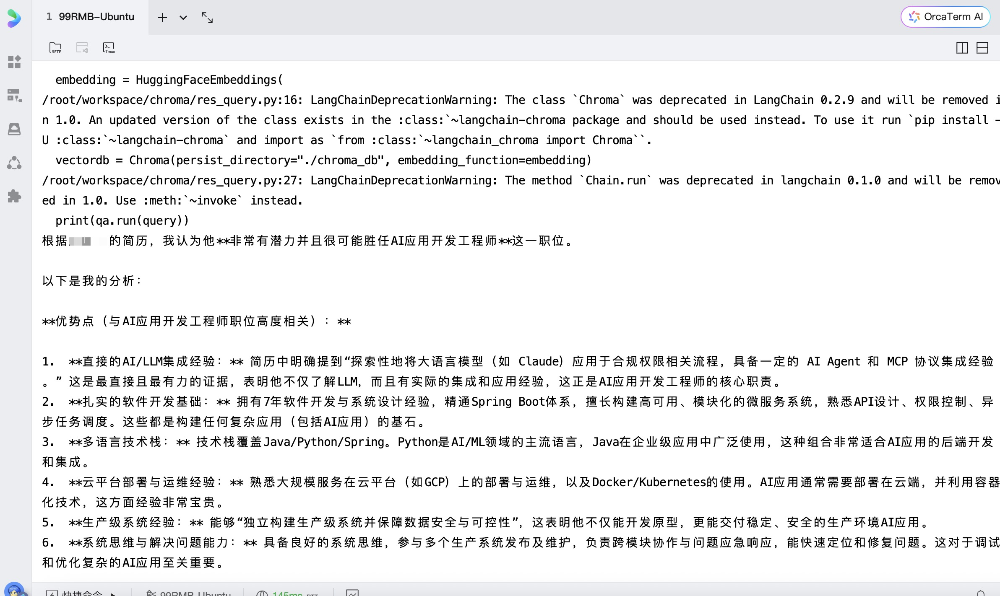

# PDF文档智能处理系统

欢迎来到yuanhao的项目基地。
这个项目是基于LangChain和Hugging Face的PDF文档向量化与智能问答系统，并部署了本地的RAG系统。

## ✨ 主要功能

- 📄 PDF文档自动解析和文本提取
- 🔍 智能文本分割和向量化
- 💾 本地向量数据库存储
- 🤖 基于文档内容的智能问答
- 🌍 支持中英文等多语言

## 🚀 快速开始

### 1. 环境准备
```bash
# 创建虚拟环境
python3.9 -m venv venv
source venv/bin/activate

# 安装依赖
pip install -r requirements.txt
```

### 2. 配置API密钥
创建 `.env` 文件：
```bash
GEMINI_API_KEY=your_gemini_api_key
```

### 3. 使用系统
```bash
# 处理PDF文档
python file_handling.py

# 智能问答
python res_query.py
```

## 📁 文件说明

- `file_handling.py` - PDF处理和向量化
- `res_query.py` - 智能问答系统
- `requirements-minimal.txt` - 核心依赖
- `docs/` - 存放PDF文档
- `chroma_db/` - 向量数据库

## 🔧 系统要求

- Python 3.9+
- 内存: 2GB+
- 存储: 500MB+ (模型文件)

## 💡 使用提示

1. 将PDF文件放入 `docs/` 目录
2. 首次运行会自动下载模型文件
3. 支持Chroma向量数据库
4. 完全本地化，保护数据隐私

## 🆘 常见问题

**Q: SQLite版本过低？**
A: 升级SQLite到3.35+

**Q: 内存不足？**
A: 减少chunk_size参数或分批处理

## 📞 联系方式

如有问题或建议，请通过以下方式联系：
- 提交GitHub Issue
- 发送邮件至：[guyuanhao@foxmail.com]

## 运行结果样例
